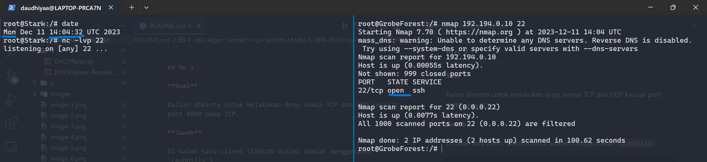

# <div align="center"><p>Jarkom-Modul-5-D06-2023</p></div>

## Anggota Kelompok

| Nama                               | NRP        |
| ---------------------------------- | ---------- |
| Achmad Khosyi’ Assajjad Ramandanta | 5025211007 |
| Daud Dhiya' Rozaan                 | 5025211021 |

## Setup Configuration

### Aura

```sh
auto eth0
iface eth0 inet dhcp

auto eth1
iface eth1 inet static
	address 192.194.0.1
	netmask 255.255.255.252

auto eth2
iface eth2 inet static
	address 192.194.0.5
	netmask 255.255.255.252

up echo nameserver 192.168.122.1 > /etc/resolv.conf
```

### Heiter

```sh
auto eth0
iface eth0 inet static
	address 192.194.0.2
	netmask 255.255.255.252
	gateway 192.194.0.1

auto eth1
iface eth1 inet static
	address 192.194.8.1
	netmask 255.255.248.0

auto eth2
iface eth2 inet static
	address 192.194.4.1
	netmask 255.255.252.0

up echo nameserver 192.168.122.1 > /etc/resolv.conf
```

### TurkRegion

```sh
auto eth0
iface eth0 inet static
	address 192.194.8.2
	netmask 255.255.248.0
	gateway 192.194.8.1

up echo nameserver 192.168.122.1 > /etc/resolv.conf
```

### Sein

```sh
auto eth0
iface eth0 inet static
	address 192.194.4.2
	netmask 255.255.252.0
	gateway 192.194.4.1

up echo nameserver 192.168.122.1 > /etc/resolv.conf
```

### GrobeForest

```sh
auto eth0
iface eth0 inet static
	address 192.194.4.3
	netmask 255.255.252.0
	gateway 192.194.4.1

up echo nameserver 192.168.122.1 > /etc/resolv.conf
```

### Frieren

```sh
auto eth0
iface eth0 inet static
	address 192.194.0.6
	netmask 255.255.255.252
	gateway 192.194.0.5

auto eth1
iface eth1 inet static
	address 192.194.0.9
	netmask 255.255.255.252

auto eth2
iface eth2 inet static
	address 192.194.0.13
	netmask 255.255.255.252

up echo nameserver 192.168.122.1 > /etc/resolv.conf
```

### Stark

```sh
auto eth0
iface eth0 inet static
	address 192.194.0.10
	netmask 255.255.255.252
	gateway 192.194.0.9

up echo nameserver 192.168.122.1 > /etc/resolv.conf
```

### Himmel

```sh
auto eth0
iface eth0 inet static
	address 192.194.0.14
	netmask 255.255.255.252
	gateway 192.194.0.13

auto eth1
iface eth1 inet static
	address 192.194.2.1
	netmask 255.255.254.0

auto eth2
iface eth2 inet static
	address 192.194.0.129
	netmask 255.255.255.128

up echo nameserver 192.168.122.1 > /etc/resolv.conf
```

### LaubHills

```sh
auto eth0
iface eth0 inet static
	address 192.194.2.2
	netmask 255.255.254.0
	gateway 192.194.2.1

up echo nameserver 192.168.122.1 > /etc/resolv.conf
```

### Fern

```sh
auto eth0
iface eth0 inet static
	address 192.194.0.130
	netmask 255.255.255.128
	gateway 192.194.0.129

auto eth1
iface eth1 inet static
	address 192.194.0.17
	netmask 255.255.255.252

auto eth2
iface eth2 inet static
	address 192.194.0.21
	netmask 255.255.255.252

up echo nameserver 192.168.122.1 > /etc/resolv.conf
```

### SchwerMountain

```sh
auto eth0
iface eth0 inet static
	address 192.194.0.131
	netmask 255.255.255.128
	gateway 192.194.0.129

up echo nameserver 192.168.122.1 > /etc/resolv.conf
```

### Richter

```sh
auto eth0
iface eth0 inet static
	address 192.194.0.18
	netmask 255.255.255.252
	gateway 192.194.0.17

up echo nameserver 192.168.122.1 > /etc/resolv.conf
```

### Richter

```sh
auto eth0
iface eth0 inet static
	address 192.194.0.22
	netmask 255.255.255.252
	gateway 192.194.0.21

up echo nameserver 192.168.122.1 > /etc/resolv.conf
```

## Routing

### Aura

```sh
# Heiter
up route add -net 192.194.8.0 netmask 255.255.248.0 gw 192.194.0.2 # A1
up route add -net 192.194.4.0 netmask 255.255.252.0 gw 192.194.0.2 # A2
# Frieren
up route add -net 192.194.0.8 netmask 255.255.255.252 gw 192.194.0.6 # A5
up route add -net 192.194.0.12 netmask 255.255.255.252 gw 192.194.0.6 # A6
up route add -net 192.194.2.0 netmask 255.255.254.0 gw 192.194.0.6 # A7
up route add -net 192.194.0.128 netmask 255.255.255.128 gw 192.194.0.6 # A8
up route add -net 192.194.0.16 netmask 255.255.255.252 gw 192.194.0.6 # A9
up route add -net 192.194.0.20 netmask 255.255.255.252 gw 192.194.0.6 # A10
```

### Frieren

```sh
up route add -net 192.194.2.0 netmask 255.255.254.0 gw 192.194.0.14 # A7
up route add -net 192.194.0.128 netmask 255.255.255.128 gw 192.194.0.14 # A8
up route add -net 192.194.0.16 netmask 255.255.255.252 gw 192.194.0.14 # A9
up route add -net 192.194.0.20 netmask 255.255.255.252 gw 192.194.0.14 # A10
```

### Himmel

```sh
up route add -net 192.194.0.16 netmask 255.255.255.252 gw 192.194.0.130 # A9
up route add -net 192.194.0.20 netmask 255.255.255.252 gw 192.194.0.130 # A10
```

## DHCP

### [Link Setup DHCP](https://github.com/daudhiyaa/Jarkom-Modul-5-D06-2023/tree/main/0)


## No 1

**Soal**

Agar topologi yang kalian buat dapat mengakses keluar, kalian diminta untuk mengkonfigurasi Aura menggunakan iptables, tetapi tidak ingin menggunakan MASQUERADE.

**Jawab**

```sh
ETH0_IP=$(ip -4 addr show eth0 | grep -oP '(?<=inet\s)\d+(\.\d+){3}')
iptables -t nat -A POSTROUTING -o eth0 -j SNAT --to-source $ETH0_IP
```

## No 2

**Soal**

Kalian diminta untuk melakukan drop semua TCP dan UDP kecuali port 8080 pada TCP.

**Jawab**

Di salah satu client (Contoh disini adalah menggunakan `LaubHills`)

```sh
echo nameserver 192.168.122.1 >/etc/resolv.conf

apt-get update
apt-get install netcat -y

# kecuali port 8080 pada TCP
iptables -A INPUT -p tcp --dport 8080 -j ACCEPT
# untuk melakukan drop semua TCP dan UDP
iptables -A INPUT -p tcp -j DROP
iptables -A INPUT -p udp -s 192.194.0.0/20 -j DROP
```

Testing

```sh
# Di LaubHills
nc -lvp 8080

# di client lain
apt-get update
apt-get install netcat -y
nc [IP_LaubHills] 8080
```

**Hasil**


## No 3

**Soal**

Kepala Suku North Area meminta kalian untuk membatasi DHCP dan DNS Server hanya dapat dilakukan ping oleh maksimal 3 device secara bersamaan, selebihnya akan di drop.

**Jawab**

Jalankan Command ini di DHCP Server & DNS Server

```sh
iptables -A INPUT -m state --state ESTABLISHED,RELATED -j ACCEPT
iptables -A INPUT -p icmp -m connlimit --connlimit-above 3 --connlimit-mask 0 -j DROP
```

Lalu lakukan testing di lebih dari 3 client

```
ping [ip DHCP Server]
ping [ip DNS Server]
```

**Hasil**

DHCP Server


DNS Server


## No 4

**Soal**

Lakukan pembatasan sehingga koneksi SSH pada Web Server hanya dapat dilakukan oleh masyarakat yang berada pada GrobeForest

**Jawab**

Jalankan Command ini di Web Server (`Sein` & `Stark`)

```sh
# terima dari GrobeForest
iptables -A INPUT -p tcp --dport 22 -s 192.194.4.0/22 -j ACCEPT
# tolak selain dari GrobeForest
iptables -A INPUT -p tcp --dport 22 -j DROP
```

Testing

```sh
# Di Web Server
nc -lvp 22

# Di GrobeForest & Client lainnya ke Sein
nmap 192.194.4.2 22

# Di GrobeForest & Client lainnya ke Stark
nmap 192.194.0.10 22
```

**Hasil**

Ke Sein


Ke Stark


## No 5

**Soal**

Selain itu, akses menuju WebServer hanya diperbolehkan saat jam kerja yaitu Senin-Jumat pada pukul 08.00-16.00.

**Jawab**

Jalankan Command ini di Web Server (`Sein` & `Stark`)

```sh
iptables -A INPUT -p tcp --dport 22 -m time --weekdays Mon,Tue,Wed,Thu,Fri --timestart 08:00 --timestop 16:00 -j ACCEPT
```

Testing

```sh
# Di Web Server
nc -lvp 22

# Di GrobeForest & Client lainnya ke Sein
nmap 192.194.4.2 22

# Di GrobeForest & Client lainnya ke Stark
nmap 192.194.0.10 22
```

**Hasil**

Ke Stark


Ke Sein


## No 6

**Soal**

Lalu, karena ternyata terdapat beberapa waktu di mana network administrator dari WebServer tidak bisa stand by, sehingga perlu ditambahkan rule bahwa akses pada hari Senin - Kamis pada jam 12.00 - 13.00 dilarang (istirahat maksi cuy) dan akses di hari Jumat pada jam 11.00 - 13.00 juga dilarang (maklum, Jumatan rek)

**Jawab**

Jalankan Command ini di Web Server (`Sein` & `Stark`)

```sh
iptables -F

# drop untuk waktu makang siang
iptables -A INPUT -p tcp --dport 22 -m time --weekdays Mon,Tue,Wed,Thu --timestart 12:00 --timestop 13:00 -j DROP
# drop untuk waktu jumatan
iptables -A INPUT -p tcp --dport 22 -m time --weekdays Fri --timestart 11:00 --timestop 13:00 -j DROP

iptables -A INPUT -p tcp --dport 22 -m time --weekdays Mon,Tue,Wed,Thu,Fri --timestart 08:00 --timestop 16:00 -s 192.194.4.0/22 -j ACCEPT
iptables -A INPUT -p tcp --dport 22 -j DROP
```

Testing

```sh
# Di Web Server
nc -lvp 22

# Di GrobeForest & Client lainnya ke Sein
nmap 192.194.4.2 22

# Di GrobeForest & Client lainnya ke Stark
nmap 192.194.0.10 22
```

**Hasil**

Rules IPTables


Jika Saat Jam Makan Siang


Jika Tidak Saat Jam Makan Siang



## No 7

**Soal**

Karena terdapat 2 WebServer, kalian diminta agar setiap client yang mengakses Sein dengan Port 80 akan didistribusikan secara bergantian pada Sein dan Stark secara berurutan dan request dari client yang mengakses Stark dengan port 443 akan didistribusikan secara bergantian pada Sein dan Stark secara berurutan.

**Jawab**

Jalankan Command ini di Heiter, karena Heiter adalah salah satu router yang menyambung ke web server

```sh
iptables -A PREROUTING -t nat -p tcp --dport 80 -d 192.177.4.2 -m statistic --mode nth --every 2 --packet 0 -j DNAT --to-destination 192.177.4.2

iptables -A PREROUTING -t nat -p tcp --dport 80 -d 192.177.4.2 -j DNAT --to-destination 192.177.0.18

iptables -A PREROUTING -t nat -p tcp --dport 443 -d 192.177.0.18 -m statistic --mode nth --every 2 --packet 0 -j DNAT --to-destination 192.177.0.18

iptables -A PREROUTING -t nat -p tcp --dport 443 -d 192.177.0.18 -j DNAT --to-destination 192.177.4.2
```

Testing Untuk Port 80

```sh
# Di Sein
while true; do nc -l -p 80 -c 'echo "Ini Dari Sein"'; done
# Di Stark
while true; do nc -l -p 443 -c 'echo "Ini Dari Stark"'; done
```

Testing Untuk Port 443

```sh
# Di Sein
while true; do nc -l -p 443 -c 'echo "Ini Dari Sein"'; done
# Di Stark
while true; do nc -l -p 443 -c 'echo "Ini Dari Stark"'; done
```

**Hasil**

## No 8

**Soal**

Karena berbeda koalisi politik, maka subnet dengan masyarakat yang berada pada Revolte dilarang keras mengakses WebServer hingga masa pencoblosan pemilu kepala suku 2024 berakhir. Masa pemilu (hingga pemungutan dan penghitungan suara selesai) kepala suku bersamaan dengan masa pemilu Presiden dan Wakil Presiden Indonesia 2024.

**Jawab**

Jalankan Command ini di Web Server (`Sein` & `Stark`)

```sh
MULAI_MASA_PEMILU=$(date -d "2023-10-19T00:00" +"%Y-%m-%dT%H:%M")

SELESAI_MASA_PEMILU=$(date -d "2024-02-15T00:00" +"%Y-%m-%dT%H:%M")

# Atur waktu untuk masa pemilu
iptables -A INPUT -p tcp -s 192.194.0.20/30 --dport 80 -m time --datestart "$MULAI_MASA_PEMILU" --datestop "$SELESAI_MASA_PEMILU" -j DROP
```

Testing di Revolte

```sh
nmap 192.194.0.10 22
```

**Hasil**


## No 9

**Soal**

Sadar akan adanya potensial saling serang antar kubu politik, maka WebServer harus dapat secara otomatis memblokir alamat IP yang melakukan scanning port dalam jumlah banyak (maksimal 20 scan port) di dalam selang waktu 10 menit.
(clue: test dengan nmap)

**Jawab**

```sh

```

**Hasil**
